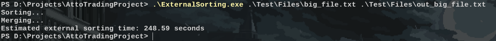
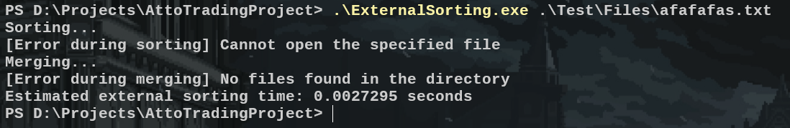
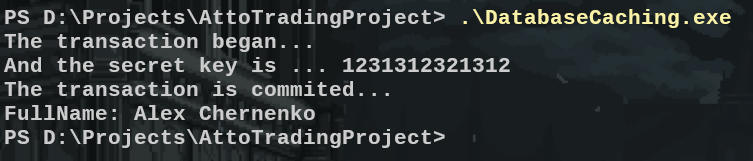

# Test Task for Atto Trading

This project is an implementation of a test task for Atto Trading for the **Junior C++ Developer – Core Platform** position.

## Project Structure
This project consists of **two sub-projects** (parts), each focusing on a different technical challenge:

- **ExternalSorting** – Implementation of an efficient external sorting algorithm for handling large datasets.
- **DatabaseCaching** – A caching mechanism to optimize database operations and improve performance.

More details on each of them will be provided in their respective sections.
## Compilation

This project is built using **[CMake](https://cmake.org/)**, with **[Ninja](https://github.com/ninja-build/ninja)** as the preferred build system and **[Clang](https://clang.llvm.org/cxx_status.html)** as the compiler. However, since the project is written entirely in **C++17** using only **STL**, it can be compiled using any modern build system and a compiler that supports the specified version of C++.

### Prerequisites
To compile the project, you need to have **the following tools** installed on your machine:
- **CMake** (version 3.20 or newer).
- **Compiler** (GCC, Clang, or MSVC).  
- **Git** (for cloning the repository).

### Compilation Instructions

Follow these steps to successfully **build** the project:  

#### 1. Clone the Repository 
```bash
git clone https://github.com/letsexisttogether/AttoTradingProject
cd AttoTradingProject
```
#### 2. Generate build files
```bash
cmake -B ./build -S ./
```
#### 3. Build the project
By default, **all targets** will be compiled. However, you can choose to build **a specific sub-project**:

```bash
# Build everything
cmake --build ./build

# Build only the ExternalSorting module
cmake --build ./build --target ExternalSorting

# Build only the DatabaseCaching module
cmake --build ./build --target DatabaseCaching
```
## External Sorting

The first sub-project implements an **external sorting** algorithm designed to efficiently **sort large datasets** that exceed available memory capacity. The input data is treated as a file containing **double-precision floating-point numbers**, in accordance with the task requirements.

The sorting process consists of three **main stages**:

- **Partitioning** the input file into smaller chunks that fit into memory.
- **Sorting** each chunk individually and writing it to an intermediate storage (temporary files).
- **Merging** all sorted chunks into a single, fully sorted output file.
This method ensures efficient sorting of large datasets by utilizing disk storage while optimizing memory usage.

Additionally, this part of the project includes a **Python-based file generator** to create input files with randomly generated double values, facilitating testing and benchmarking of the sorting algorithm.

### Usage

After compiling this part of the project, navigate to the **build directory**, where you will find a dedicated folder named **ExternalSorting**. Inside this folder, you will find the **compiled executable**.

To run the program, use the following command:
```bash
ExternalSorting <input_file.txt> <output_file.txt>
```
- The first argument specifies the **file containing the unsorted data**.
- The second argument is **optional**. If not provided, the program will default to using "*Output.txt*" as the **output file name**.

### Usage Example 

If everything **runs successfully**, you will see the program processing the data and **generating the sorted output file. Additionally, the program will display the **estimated time** it took to complete the given task.



However, if the **input file is missing**, you will see an appropriate **error message** indicating that the file could not be found.



### Additinal Notes 
This program is **recommended to be run** specifically with files generated using the **Python file generator**, as the **internal components** responsible for parsing data for file writing **are synchronized** with the mentioned generator.

In other words, it is **guaranteed** that when running the program on the **specified files**, it will use **less than 100 MB of memory** and will be able to sort **large files** (around 1 GB) in **less than 10 minutes**. The program **ensures functionality** for any files containing data in the required format and **guarantees the sorting speed** for those files. However, it **does not guarantee the same memory usage** during the second phase of the algorithm (sorting), as different floating-point numbers formats may **require additional memory** when interpreting (writing to temporary files).

### Functional Units

This sub-project contains the following **functional units** (systems of classes, individual classes, functions, etc.):

#### FileProcess
A system of classes designed for **reading and writing** files containing an unlimited number of bytes. These classes act as **wrappers for STL functions**, handling potential errors. Each of these classes uses the concept of data processing by **chunks (batches)**, meaning that **instead of** performing **sequential operations**, large volumes of data are **read or written in chunks**.

#### Buffers  
Classes built on top of FileProcessors using the **composition principle**, which conditionally **control the number of bytes being processed** by the corresponding class, the data it handles, and other necessary parameters. Among them, the following classes are distinguished:
- **InputBuffer**: Allows **retrieving** pre-read data **one unit at a time**, and when the data is exhausted, it reads a new batch.
- **OutputBuffer**: Conversely, this class **accepts** data **one unit at a time** up to a certain limit (the maximum allowed size), after which it writes the data to a file using the appropriate class from the FileProcessor system.

#### Parse
A system of classes that is **exclusively used** within FileProcessors to **regulate** how the data should be **interpreted**. It includes two main classes:
- **ByteParser**: Converts a **byte array into values** of the required type (double in this case).
- **ValueParser**: Converts an **array of values into a byte array** based on the schema provided in the constructor.

#### Spawn
A class system responsible for **creating** the corresponding **Buffers**, primarily **calculating the required amount of memory** to allocate to each buffer relative to the overall available memory.

#### Sort
The main class of the program, responsible for **implementing** each stage **of the current algorithm**. The sorting of parts of the input file is done using the **STL sort (std::sort)** and the FileProcess system. The merging of these parts is performed using a **priority queue (std::priority_queue)** in combination with the Buffers.
## Database Caching

The second sub-project represents a general implementation of the **data caching principle** when performing basic **database operations**: set, get, and delete (remove), as well as utilizing a **transaction mechanism**. Each of the aforementioned **actions** could be executed in separate threads, as they **are protected** using appropriate **thread synchronization** elements.

For the prototype of this project, a **database interface** was provided, **including** standard methods for performing the **operations mentioned above**. This interface is **implemented** by a class with caching support using the **Decorator** design pattern.


### Usage
The usage is straightforward, as the program **doesn't require any additional parameters** and serves as a **concise representation** of the implemented caching functionality. The code is **designed with future extension** in mind, allowing it to be easily **integrated and used** as a caching system **in a real-world project**. 

To run the program, use the following command:
To run the program, use the following command:
```bash
Database Caching
```

### Usage Example 

If everything is working correctly, you'll see output similar to this.



### Functional Units

#### Database
This class system consists of a base **interface i_db**, which has been extended with two classes:
- **DatabaseCacher**: **Implements** the specified interface and **takes an object of the same type** to create aggregation, thus adhering to the **Decorator** design pattern. Additionally, it **delegates caching functionality** to the Cache class system while focusing on **ensuring** the **correct synchronization** of potential multi-threaded operations and **caching during transaction actions**.
- **DecoyDatabase**: A mock database, created for **testing the functionality** of the aforementioned DatabaseCacher class.

#### Cache
The Cache system is a set of classes **focused on** performing **caching** operations for **key-value pairs**. It includes a **non-abstract base class** responsible for **basic caching functions**. In addition to the base class, there is an extension:
- **SizableCache**: Extends the base functionality and **controls the maximum number of elements** in the cache. Once the cache reaches its capacity, it **removes the specified number of entries to maintain space** for new ones.